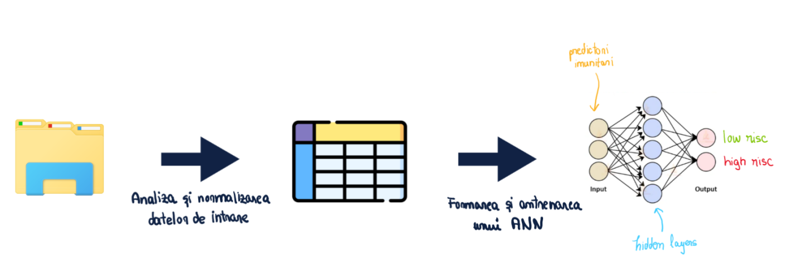

<h1>EVOLUȚIA GRIPEI</h1>
<h2>PROBLEMA ABORDATĂ</h2>

Sistemul imunitar cuprinde mai multe tipuri de celule care lucrează împreună pentru a dezvolta un răspuns eficient la un anumit agent patogen. Cu toate acestea, care dintre aceste nenumărate tipuri de celule sunt importante într-un anumit răspuns nu este bine înțeles. Abordarea imunologică își propune să măsoare impactul expresiei genelor și diferitelor celule și molecule din sistemul imunitar în timpul unei infecții sau vaccinări și utilizează metodelor de Machine Learning pentru a discerne care componente sunt cele mai importante. Aceste studii au scopul practic de a determina ce face o formulare de vaccin mai bună decât alta sau modul în care indivizii variază. Pentru a realiza acest lucru, este crucială o modelare precisă a proceselor complexe care duc la un rezultat de succes.
    
<h3>SCOP</h3>    
<ul>
    <li>Identificarea predictorilor imunitari de bază care pot discrimina între persoanele cu răspuns ridicat sau scăzut după vaccinarea antigripală.</li>
    <li>Astfel se poate prezice mai exact daca un pacient are un risc ridicat sau scazut de a fi infectat.</li>
</ul>   
<h3>TIPUL PROBLEMEI</h3> 
<ul>
    <li>Clasificare binara</li>
    <li>input = predictorii imunitari de baza</li>
    <li>output = 2 tipuri de risc (low risk/high risk)</li>
</ul>       
<h2>SOLUȚIA NOASTRĂ</h2>
<ol>
    <li>Analizarea datelor de intrare prin intermediul vizualizării distribuției lor.</li>
    <li>Normalizarea datelor.</li>
    <li>Alegerea predictorilor imunitari de bază.</li>
    <li>Formarea unei rețele neuronale artificiale (ANN)</li>
    <li>Antrenarea rețelei și testarea calității acestuia</li>
</ol>
    

